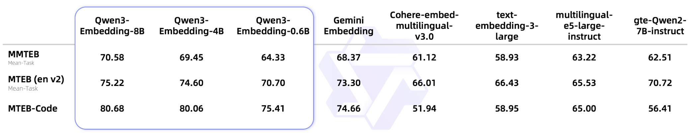

# RAG-Arena: 讲解并评估多种RAG算法

[](https://github.com/ZehaoJia1024/RAG-Arena)
[](https://www.python.org/)

欢迎来到 RAG 竞技场！本项目旨在构建一个开放、透明、易于理解的平台，用于评估和比较各种**检索增强生成 (RAG)** 算法的性能。

> **GitHub 仓库地址: [https://github.com/ZehaoJia1024/RAG-Arena](https://github.com/ZehaoJia1024/RAG-Arena)**

## 🌟 项目简介

RAG (Retrieval-Augmented Generation) 是为大型语言模型（LLM）扩展知识、提升回答准确性的绝佳工具。然而，市面上有众多 RAG 技术和变体，它们的实际效果如何？

本项目受 [Fareed Khan 的博客](https://levelup.gitconnected.com/testing-18-rag-techniques-to-find-the-best-094d166af27f) 启发，但我希望创建一个更系统、更透明的评估环境。因此设计了本项目。我们将在这里手动复现、评估和比较不同的 RAG 策略，希望能为 RAG 技术的应用提供性能参考，并作为一份详尽的 RAG 学习教程。

## 🏆 RAG 算法排行榜

下方表格汇总了本竞技场中已评估的 RAG 算法。点击算法名称可直接跳转到对应的 Jupyter Notebook 实现页面，查看其详细原理和代码。

| 算法名称                                                      | 简介                       | 最终得分 (满分5) |
|:----------------------------------------------------------|:-------------------------|:----------:|
| **[RAG](01%20RAG.ipynb)**                                 | 最基础的 RAG 实现，作为后续所有优化的基准。 |   *3.47*   |
| **[Semantic Chunking RAG](02%20Semantic%20Chunking%20RAG.ipynb)** | 语义分割的RAG                 |   *3.43*   |


## ✨ 主要特点

1.  **评估多种RAG算法**：复现不同的RAG算法，并在统一的评估标准下进行横向对比，发掘高效的 RAG 策略。
2.  **深入原理，不依赖高级框架**：为了真正理解算法核心，我们不使用 `LangChain`、`LlamaIndex` 等高级库。所有核心组件将使用 `numpy` 等基础库手动实现，让学习者洞悉其工作原理。
3.  **LLM 作为裁判，客观评估**：采用性能强大的 LLM 作为“裁判”，对不同 RAG 算法的生成结果进行多维度、标准化的打分，确保评估的客观性和一致性。

## ⚙️ 评估策略

一个公平的竞技场需要一套严格的规则。我们的评估流程包含以下三个核心要素：

### 1. 知识文档准备

为了测试 RAG 的真实能力，我们需要提供模型“未知”的知识。我们知道 Qwen3 系列模型的训练数据截止到 **2024年10月**，因此我们选取了在此之后“发布”的文档作为知识库，以保证公平性。


*   **知识源文档**:
    1.  Qwen3 技术报告 (`25年5月`)
    2.  Qwen3 Embedding 技术报告 (`25年6月`)
    3.  DeepSeek-R1 技术报告 (`25年1月`) - **作为干扰文档，测试 RAG 的辨别能力**。

所有文档均已翻译为中文，方便处理。

### 2. 问题与答案的构建 (QA Set)

我们利用强大的 `Gemini 2.5 Pro` 模型，基于上述文档生成了一套高质量、高难度的问题与标准答案（Ground Truth）。

*   **问题生成策略**:
    *   针对 Qwen3 相关文档，生成10个高难度问题。
    *   其中包含 **2个“陷阱”问题** (例如：内容不存在、与原文相悖)，用于测试 RAG 的鲁棒性。
    *   不为干扰文档 `DeepSeek-R1` 生成问题。

*   **答案生成策略**:
    *   对于有效问题，答案必须严格来源于文档原文。
    *   对于“陷阱”问题，标准答案为“根据提供的文档，我无法回答该问题”。

### 3. 评估方法: LLM-as-a-Judge

我们采用 **LLM as a judge** 的方法，使用 `Qwen3-235B-A22B` 模型作为评估裁判。为了提升评估的稳定性和一致性，我们将评分标准进行了原子化拆解。

*   **评估维度 (5分制)**:
    1.  **Correctness (正确性)**: 生成答案与标准答案的语义是否一致。
    2.  **Completeness (完整性)**: 是否覆盖了标准答案的所有关键信息点。
    3.  **Clarity & Conciseness (清晰简洁性)**: 语言是否流畅、易懂、无冗余。

*   **最终得分**: 对10个问题的三维评分取平均值，得到该 RAG 算法的最终得分。

*   **裁判的系统提示 (System Prompt)**:
    ```
    # 角色
    你是一个用于评估检索增强生成（RAG）系统输出质量的专家级AI评判员。你的评估必须严格、客观，并遵循以下所有指令。

    # 任务
    你的评估必须基于以下三个输入：
    1. 【用户问题】
    2. 【正确答案】 (Ground Truth，作为黄金标准)
    3. 【生成答案】 (需要被评估的答案)

    请根据以下三个维度进行评估，并为每个维度打出1-5分的整数分数...
    
    ...（详细提示见博客原文）

    【输出格式要求】
    你的评估结果必须以一个严格的JSON对象格式返回...
    ```

## 🧠 模型选择

我们精心挑选了兼具性能和效率的模型组合：

*   **检索模型 (Embedding Model)**: **`Qwen3-Embedding-0.6B`**
    *   **理由**: 模型小、速度快、成本低，且在同等规模下性能卓越，非常适合实际应用场景。
    *   

*   **RAG 回复模型 (Generator Model)**: **`Qwen3-4B`**
    *   **理由**: 在保证回复质量的同时，拥有更快的响应速度和更低的部署成本，是性能与效率的理想平衡。
